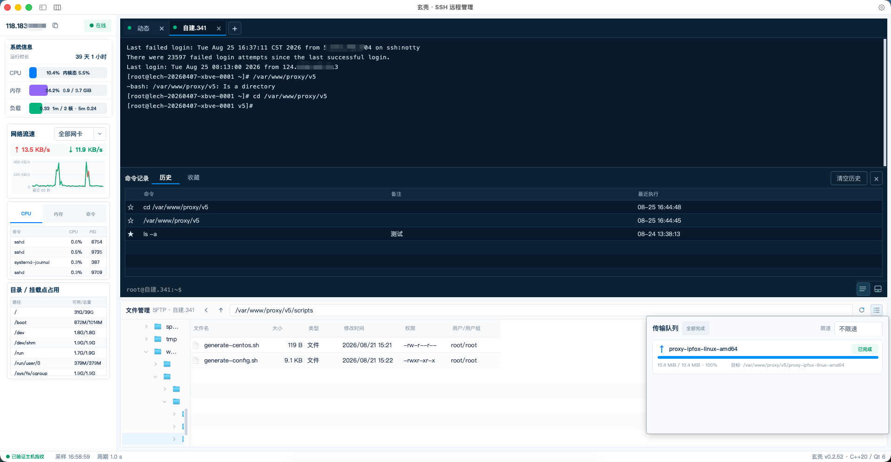
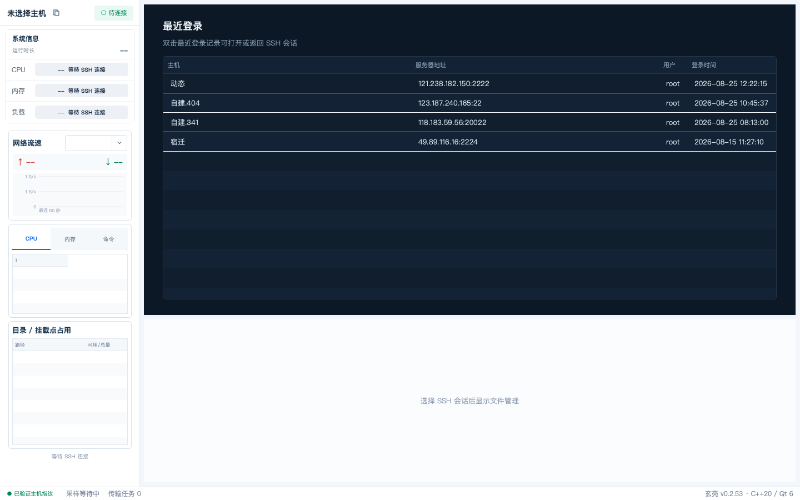
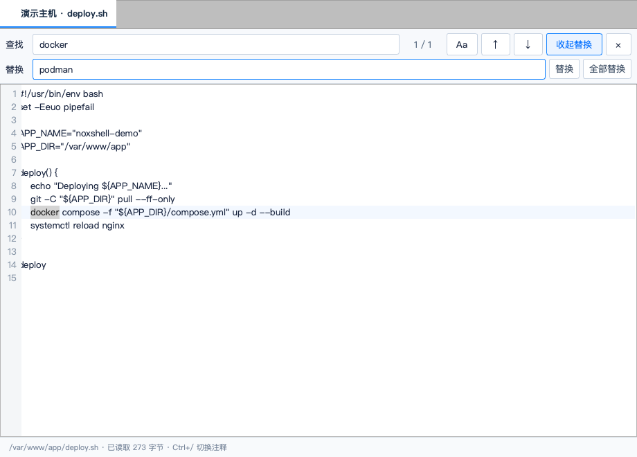

<p align="center">
  
</p>

<h1 align="center">玄壳 NoxShell</h1>

<p align="center">
  一款面向服务器运维的现代化 SSH 桌面客户端。<br>
  在同一个紧凑工作区中完成终端操作、实时监控、SFTP 文件管理与远程文件编辑。
</p>

<p align="center">
  <a href="https://github.com/abcxi/NoxShell/releases/latest"></a>
  
  
  
  
</p>

<p align="center">
  <a href="#下载">下载</a> ·
  <a href="#界面预览">界面预览</a> ·
  <a href="#核心功能">核心功能</a> ·
  <a href="#本地构建">本地构建</a>
</p>



> 截图使用本地演示会话生成，不包含真实服务器凭据。当前版本：`v0.2.55`。

## 为什么选择玄壳

| 一站式运维 | 原生桌面体验 | 会话互不干扰 | 安全保存凭据 |
| --- | --- | --- | --- |
| 终端、监控、文件和编辑器同屏协作 | C++20 + Qt 6，界面紧凑、启动迅速 | 每个标签拥有独立 SSH 连接与配置快照 | 密码和私钥口令进入系统凭据库，不写入 SQLite |

玄壳适合需要同时管理多台 Linux 服务器、频繁查看资源状态、编辑配置文件和传输文件的开发与运维人员。它不试图把功能藏进层层页面，而是把最常用的操作放在一个可拖动、可收起的工作区内。

## 界面预览

### 起始页与最近登录

应用启动时不会自动连接服务器，也不会恢复旧终端。起始页按时间倒序显示最近成功登录记录，相同主机只保留最新一条，双击即可重新建立会话。



### 终端、监控与文件管理

连接后，左侧展示 CPU、内存、负载、网络流速、进程和挂载点信息；右侧上方是多标签终端，下方是与当前会话联动的 SFTP 文件管理器。各区域可以收起，也可以拖动分隔条调整大小。


### 远程文件编辑

双击远端文本文件即可打开独立编辑窗口。编辑器支持多标签、行号、当前行高亮、查找/替换、撤销、快捷保存和 Shell 注释切换；文件有未保存修改时会显示红点，关闭前主动提醒。



## 核心功能

### SSH 终端

- 多终端标签，每个标签使用独立线程、socket、libssh2 session 和连接快照。
- VT/ANSI 网格渲染，支持 256 色、光标与滚动区控制、备用屏幕、中文输入、功能键和鼠标报告。
- 最多保留 5000 行滚屏历史，支持拖选、双击选词、复制、粘贴和全选。
- `Cmd/Ctrl+C` 会根据场景智能复制或向远端发送中断信号，可正常退出 `top` 等前台程序。
- 标签状态用空心点、进度环和绿色实心点区分未连接、连接中和已连接。
- 标签右键支持连接、断开、清屏、复制会话、关闭当前/其他/全部标签。
- 命令历史与收藏按主机去重保存，支持备注、再次执行、删除，以及分别清空历史或收藏。
- 字体、字号和行间距可按系统字体实时设置，并同步到已打开及新建终端。

### 实时监控

- 秒级采集 CPU、内核态、内存、1/5/15 分钟负载和系统运行时长。
- 展示全部网卡或指定网卡的实时上/下行速率与最近 60 秒曲线。
- 查看 CPU、内存占用最高的进程和实时命令列表。
- 展示目录与挂载点的可用空间/总量，便于快速定位容量问题。
- 监控历史保留 7 天，可设置 CPU、内存、负载与磁盘阈值并记录告警事件。
- 指标采集复用当前已认证 SSH 会话中的独立 channel，不会污染终端输入输出。

### SFTP 文件管理

- 左侧目录树逐层加载，右侧显示文件名、大小、类型、修改时间、权限和用户/用户组。
- 支持路径输入、刷新、返回、上级目录和终端 `cd` 路径联动。
- 支持 Shift/Cmd 多选、批量下载、批量删除、重命名、新建文件和新建目录。
- 可从 Finder 或资源管理器拖入一个或多个本地文件，直接上传到当前目录或指定目录。
- 上传/下载进入持久化队列，支持限速、取消、失败重试和 `.noxshell.part` 断点续传。
- 权限管理支持所有者、组、其他用户的读/写/执行位，以及目录递归范围。
- 文件区可一键收起，为终端释放更多空间；传输任务出现时自动展示队列。

### 远程文件编辑

- 同一服务器的文件复用一个多标签编辑窗口，标签显示“服务器 · 文件名”。
- `Cmd/Ctrl+S` 保存、`Cmd/Ctrl+Z` 撤销、`Ctrl+/` 切换 `#` 注释、`Cmd/Ctrl+W` 关闭标签。
- `Cmd/Ctrl+F` 查找，`Cmd+Option+F`（macOS）或 `Ctrl+H`（Windows）展开替换。
- 支持前后循环匹配、区分大小写、单个替换、全部替换和匹配数量提示。
- 保存通过远端临时文件原子替换，并保留原文件权限；二进制文件和超过 4 MiB 的文件不会误入文本编辑器。

### 主机与连接管理

- 主机按分组展示，支持搜索、拖动移动分组、右键新建连接、编辑、复制和删除。
- 新增/编辑窗口提供连接测试，可在保存前校验 TCP、SSH 握手、主机指纹和认证凭据。
- 已建立会话保持原配置快照；修改主机 IP、端口或凭据不会影响旧会话，下次连接才使用新配置。
- 已知主机指纹严格绑定 `IP/域名:端口`，目标变化时不会错误复用旧指纹。
- 支持密码、私钥、SSH Agent，以及自动协商 `keyboard-interactive` / `password` 认证。
- 密码和私钥口令分别保存在 macOS Keychain 或 Windows Credential Manager；SQLite 只保存凭据引用。

## 下载

[前往 GitHub Releases 下载最新版本](https://github.com/abcxi/NoxShell/releases/latest)

| 系统 | 安装包 | 适用设备 |
| --- | --- | --- |
| macOS | [Apple Silicon DMG](https://github.com/abcxi/NoxShell/releases/download/v0.2.55/%E7%8E%84%E5%A3%B3-v0.2.55-macOS-arm64.dmg) | M1、M2、M3、M4 等 Apple 芯片 Mac |
| macOS | [Intel DMG](https://github.com/abcxi/NoxShell/releases/download/v0.2.55/%E7%8E%84%E5%A3%B3-v0.2.55-macOS-x86_64.dmg) | Intel 芯片 Mac |
| Windows | [安装版 EXE](https://github.com/abcxi/NoxShell/releases/download/v0.2.55/NoxShell-v0.2.55-Windows-x64.exe) | 64 位 Windows，推荐使用 |
| Windows | [便携版 ZIP](https://github.com/abcxi/NoxShell/releases/download/v0.2.55/NoxShell-v0.2.55-Windows-x64.zip) | 64 位 Windows，解压即用 |
| 校验文件 | [SHA256SUMS.txt](https://github.com/abcxi/NoxShell/releases/download/v0.2.55/SHA256SUMS.txt) | 验证下载文件完整性 |

> 安装包会在推送对应版本标签且 GitHub Actions 构建成功后出现。当前 macOS 包使用临时签名，尚未进行 Apple Developer ID 签名和公证；首次打开时可能需要在“系统设置 → 隐私与安全性”中确认。

## 数据与安全

- 服务器配置、监控历史、告警、传输状态和 `known_hosts` 记录保存在 Qt SQLite 数据库。
- 数据库默认位于系统应用数据目录，文件名为 `noxshell-ops.sqlite3`。
- 系统凭据服务名为 `com.noxshell.ops.ssh`，密码与私钥口令不会写入数据库。
- 日志位于应用数据目录的 `logs/noxshell-ops.log`，单文件 5 MiB 后轮换并保留 3 份。
- 日志会对常见密码、口令、令牌和 Authorization 字段进行脱敏。

## 技术实现

- C++20 / Qt 6 Widgets
- libssh2：SSH、PTY、exec channel 和 SFTP
- Qt SQLite：配置、历史、告警和传输状态
- Linux 指标来源：`/proc/stat`、`/proc/meminfo`、`/proc/loadavg`、`/proc/net/dev`、`df -Pk`
- macOS Keychain / Windows Credential Manager：系统级凭据保存
- CMake、CTest、CPack、NSIS、GitHub Actions：构建、测试和发布

## 本地构建

要求：CMake 3.25+、C++20 编译器、Qt 6.5+（Core、Gui、Network、Sql、Svg、Widgets）、libssh2 1.11+。

```bash
cmake -S . -B build -DCMAKE_BUILD_TYPE=Debug
cmake --build build --parallel
ctest --test-dir build --output-on-failure
```

macOS 启动：

```bash
open build/NoxShell.app
```

界面开发推荐使用增量编译脚本：

```bash
./script/qt-ui-start.sh
./script/qt-ui-start.sh --test
./script/qt-ui-start.sh --build-only
```

脚本会自动定位 Qt 并复用 `build` 中的 CMake 缓存，只编译发生变化的文件；使用 `--clean` 可重新生成构建目录。

生成 Release 包：

```bash
./script/package-release.sh
```

macOS 默认生成 LZMA 压缩的 `.dmg`。Windows 使用 CPack + NSIS 生成安装版 `.exe`，同时保留免安装 `.zip`。

`.github/workflows/release.yml` 支持手动运行，也会在推送与 `CMakeLists.txt` 版本一致的 `v*` 标签时，自动构建：

- macOS Apple Silicon `.dmg`
- macOS Intel `.dmg`
- Windows x64 NSIS `.exe` 与便携 `.zip`
- 所有产物的 `SHA256SUMS.txt`

## 项目结构

```text
src/core      主机模型、SSH 会话、指标解析、凭据与持久化
src/ui        Qt Widgets 界面、终端、监控、文件管理和编辑器
script        增量编译、图标生成和发布打包脚本
docs          发布说明与 README 图片
tests         Qt Test / Smoke Test
output        本地发布产物
```

更多发布说明见 [docs/RELEASE.md](docs/RELEASE.md)。
